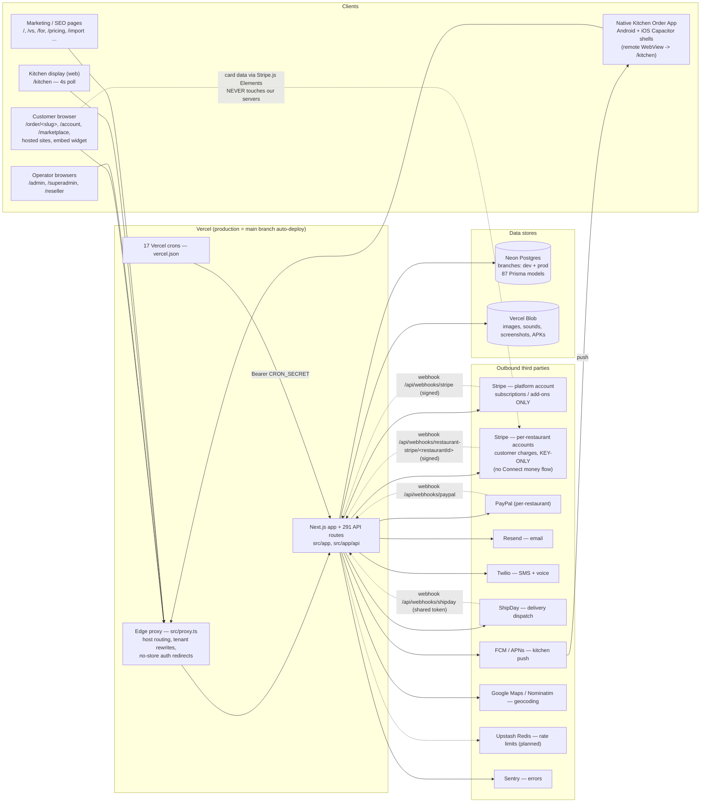
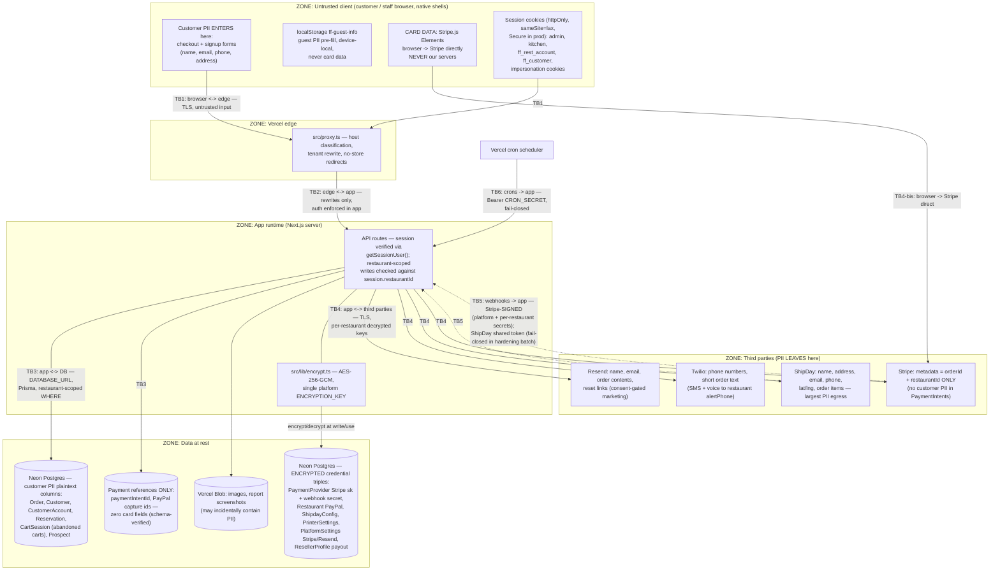

# Launch-Readiness Audit — 02: Architecture & Data Flow

**Date:** 2026-07-10. Companion to `01-system-inventory.md` (same audit context: platform **live** as of tonight; key-only per-restaurant Stripe charging, no Connect money flow in production, platform Stripe bills subscriptions/add-ons only; production branch `main` auto-deployed by Vercel).

---

## 1. Architecture diagram

Notes (traceability):
- Edge routing: `src/proxy.ts` + `src/lib/domains/resolve.ts` (LRU cache `src/lib/domains/lru.ts`; internal resolve-host API guarded by `INTERNAL_API_SECRET`).
- Payment integration: `src/lib/stripe.ts` (per-restaurant key-only charges; PaymentIntent metadata = `{ orderId, restaurantId }` only, `capture_method: manual`, platform fee always 0; Connect routes under `src/app/api/stripe/*` are legacy). PayPal: `src/lib/paypal.ts`.
- Webhook dedup ledgers: `StripeWebhookEvent` / `PaypalWebhookEvent` (`prisma/schema.prisma` lines 703/719); dedup atomicity + per-restaurant refund-sync webhook + ShipDay fail-closed land in tonight's hardening batch.
- Cron auth: `src/lib/cron-auth.ts` (fail-closed without `CRON_SECRET`).
- Push: `src/lib/push.ts` (FCM HTTP v1, hand-rolled OAuth JWT; iOS via APNs; continuous ring via `/api/cron/ios-ring-pending`).

---

## 2. Trust-boundary diagram

**Sensitive-data lifecycle (enters → moves → rests → leaves):**

| Data class | Enters | Moves | Rests | Leaves |
|---|---|---|---|---|
| Customer PII (name/email/phone/address) | Checkout (`/api/orders`) + account signup | Edge → app → Prisma | `Order`, `Customer`, `CustomerAccount`, `Reservation`, `CartSession` (abandoned carts), address tables — plaintext columns in Neon | Resend (emails), Twilio (SMS/voice), ShipDay (name/address/phone/lat-lng), receipts to PrintNode when enabled. Stripe gets **orderId + restaurantId only** |
| Payment card data | **Never enters our servers** — Stripe.js Elements posts from the browser to Stripe directly | n/a | We store only PaymentIntent/PayPal reference IDs (schema-verified: zero card fields) | n/a |
| Restaurant credentials (Stripe sk, PayPal, ShipDay, Resend, PrintNode keys) | Admin/superadmin settings UIs | Encrypted at write via `src/lib/encrypt.ts` | AES-256-GCM triples (`*Enc`/`*Iv`/`*Tag`) in Neon; key = platform `ENCRYPTION_KEY` | Decrypted in-memory per request to call the provider; never logged |
| Sessions | Login flows | Signed JWT cookies | httpOnly, sameSite=lax, `__Secure-` prefix in prod (`src/lib/auth.ts`, `auth-kitchen.ts`, `restaurant-customer-session.ts`, `customer-session.ts`) | n/a |
| Guest checkout pre-fill | Customer device only | — | localStorage `ff-guest-info` (device-local, no card data) | Only back to the same checkout form |

---

## 3. Data at rest

| Store | Data categories | Encryption |
|---|---|---|
| Neon Postgres — customer/staff/reseller PII | Names, emails, phones, addresses, lat/lng (`Order`, `Customer`, `CustomerAccount`, `Reservation`, `CartSession`, `Prospect`, `User`, `RestaurantBillingProfile`, ...) | Provider disk encryption only; **plaintext columns** at the application layer |
| Neon Postgres — third-party credentials | Restaurant Stripe sk + webhook secret, PayPal, ShipDay, PrintNode, platform Stripe/Resend, reseller payout details | **AES-256-GCM** per-value (random 12-byte IV) via `src/lib/encrypt.ts`; single platform `ENCRYPTION_KEY` |
| Neon Postgres — auth material | `passwordHash` columns (User/Customer/CustomerIdentity); reset/verify tokens (plain, single-use, short-lived); `Restaurant.kitchenSessionToken` (plain); `KitchenPushToken` device tokens (plain, revocable) | Hashed (passwords); plain (tokens) |
| Neon Postgres — payment references | `paymentIntentId`, PayPal order/authorization/capture ids, Stripe customer/subscription/invoice ids; **zero card fields** | Plain (non-secret references) |
| Vercel Blob | Menu/promo images, logos, kitchen sounds, reseller assets, bug-report screenshots (may incidentally contain admin-screen PII), APKs | Provider-side only; public-URL semantics |
| Browser localStorage | `ff-guest-info` guest PII pre-fill; KDS device prefs (no PII) | None (device-local by design) |
| Vercel env store | All §5 env secrets incl. `ENCRYPTION_KEY`, `FIREBASE_SERVICE_ACCOUNT`, `FFOS_TWILIO_AUTH_TOKEN`, `DATABASE_URL` | Vercel-managed; plaintext to the runtime |

---

## 4. Observations feeding findings

- No true staging environment: local dev (port 3001, dev Neon branch) → push to `main` → production. Vercel preview deployments exist but their env/DB posture is set in the dashboard and unverified from the repo — with only two Neon branches, a preview necessarily points at dev or prod.
- Schema changes are push-based (`prisma db push` via `scripts/push-schema-to-both.ts`): no versioned migrations (single vestigial init migration), no down-migrations, and deploy/schema ordering is a manual two-step decoupled from Vercel builds.
- No automated database backups, no pg_dump tooling, no documented or tested restore; Neon PITR depends on plan tier and is unverified — while live card payments are now flowing.
- A single platform `ENCRYPTION_KEY` protects every at-rest credential (restaurant Stripe keys, PayPal, ShipDay, Resend, PrintNode, reseller payouts); rotation without re-encryption silently breaks all of them, and no rotation/re-encryption procedure exists ("never change ENCRYPTION_KEY" is the only documented guidance).
- Rollback is Vercel instant-promote with no written runbook, and code rollback does not roll back the database — safe only for additive schema changes, an interaction nowhere documented.
- No CI: `npm run preflight` (tsc + 533 tests + build) is discipline-enforced only; nothing gates a push to the production branch.
- High-value plaintext env secrets (`FIREBASE_SERVICE_ACCOUNT` full service-account JSON, `FFOS_TWILIO_AUTH_TOKEN`) sit alongside an out-of-date `.env.example` that omits ~15 live variables and carries two stale entries — a fresh-environment rebuild would silently lose SMS/voice/push/cron/uploads.
- ShipDay inbound webhook accepted unauthenticated callers whenever `SHIPDAY_WEBHOOK_TOKEN` was unset (warning only); the fail-closed fix is in tonight's uncommitted hardening batch and the prod env var needs confirming.
- PII persists beyond orders: `CartSession` keeps abandoned-cart emails/phones, `Prospect` holds contact data for people who never signed up, and reseller bug-report screenshots in Blob can incidentally capture customer PII — none with a documented retention policy.
- The Android release keystore (`feefree-release.jks`) and its password exist as a single local copy with no off-machine backup; loss permanently breaks Play Store update continuity.
