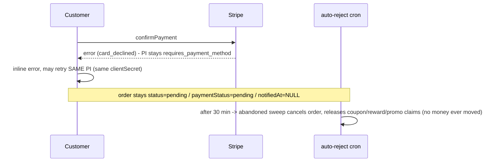
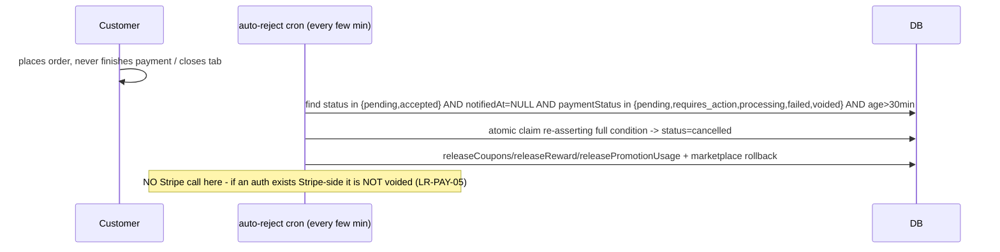
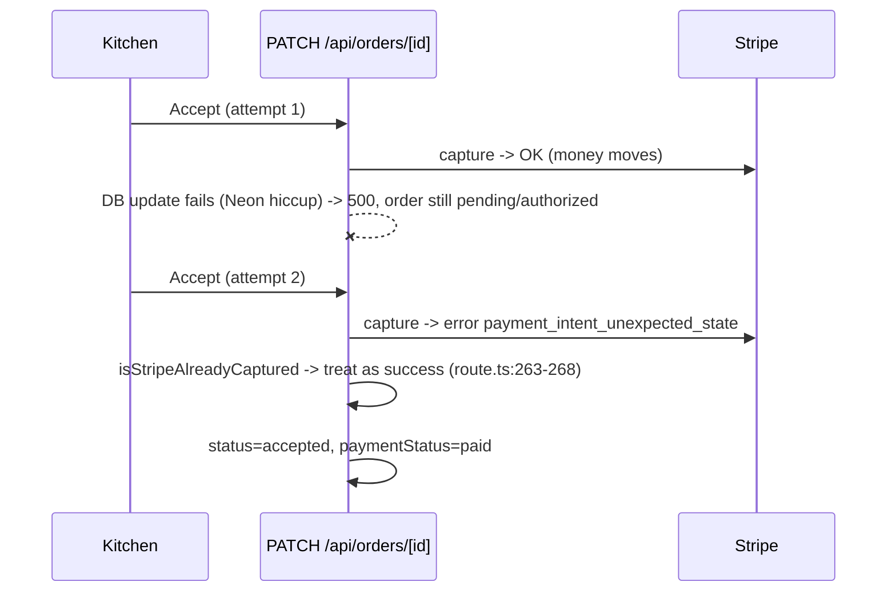
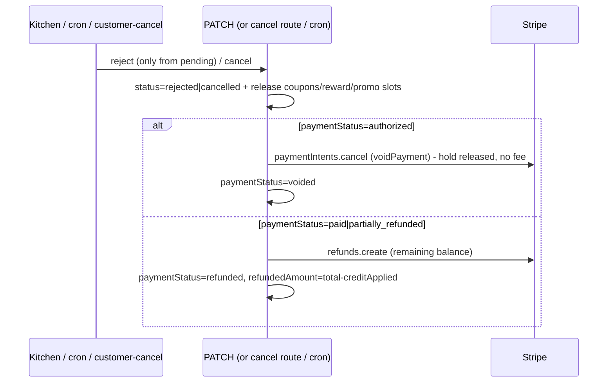
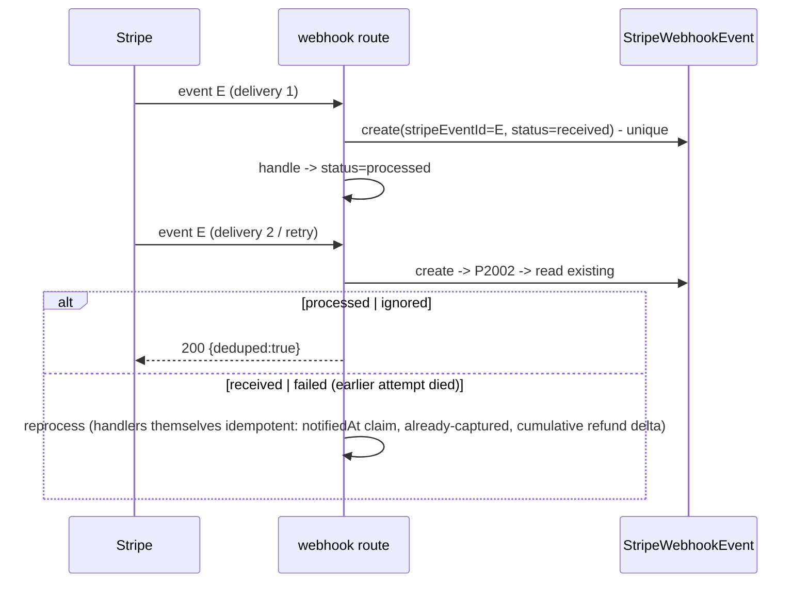

# Launch-Readiness Audit — 03: Payments & Stripe Architecture

**Date:** 2026-07-10. Companion to `01-system-inventory.md` and `02-architecture-and-data-flow.md`.

**Audit context.** The platform went **live on 2026-07-10**; this deliverable governs continuing live operation. Customer payments use a **key-only, per-restaurant direct-charge** model (no Stripe Connect money flow in production). Fee Free's own platform Stripe account bills **subscriptions and add-ons only**. The per-restaurant refund-sync webhook shipped **tonight** (commit `91d11c07`). Findings below were produced by four independent read-only auditors (customer-payment architecture, refund/dispute/reconciliation, PayPal/cash/reward-credit, subscription billing); their raw output was de-duplicated into the canonical finding set in §7.

> **Reader's note on the Critical (LR-PAY-01).** It is a real money-loss defect but **latent**: a production audit on 2026-07-10 confirmed **zero current live exposure** — only one restaurant has auto-accept enabled and it takes no online card, and Luigi's Lasagna (auto-accept off) has its 550 paid card orders captured correctly. It becomes live-money the moment *any* restaurant enables auto-accept **and** online card. Treat it as a go-live blocker for that configuration.

---

## 1. Payment architecture

### 1.1 Key-only direct-charge model (no Connect, no platform fee)

Each restaurant pastes its **own** Stripe secret + publishable keys. Keys are AES-encrypted at rest and decrypted only inside `getRestaurantStripe()` (`src/lib/stripe.ts:450-491`). There is no Connect and no platform fee: `PLATFORM_FEE_PERCENT=0` (`src/lib/stripe.ts:227-228`), `platformFeeCents` is always `0` on direct charges (`src/lib/stripe.ts:565-566`). Every customer charge is a **direct charge on the restaurant's own account** — Fee Free is never in the customer money flow.

The customer card path is split so card data never reaches our systems:

1. **Client (no card fields).** `CheckoutModal` collects contact/address/tip only — no card/CVC/PAN inputs. `placeOrder()` (`src/app/order/[slug]/OrderingPageClient.tsx:3844-4143`) POSTs `/api/orders` with a client-generated `idempotencyKey` (`:3963-3973`), then for card orders POSTs `/api/public/payment-intent` (`:4085-4098`) and navigates to `/order/[slug]/payment?orderId&clientSecret&pk`. Card entry happens **only** on that page, inside Stripe's hosted `<PaymentElement/>` within `<Elements stripe={loadStripe(pk)}>` (`src/app/order/[slug]/payment/PaymentPageClient.tsx:44,75-79`), confirmed via `stripe.confirmPayment({elements, return_url})` (`:28-33`). Card number/CVC never touch our DOM, server, logs, or analytics.

2. **Server price authority.** `/api/orders` POST re-prices everything server-side: items re-validated against the menu, promos re-run by the engine, fees/tax/tip recomputed; `serverTotal` at `src/app/api/orders/route.ts:1757`. Client-sent subtotal/total are ignored; tip is clamped (`:1753-1756`). Every money figure on an order is authoritative server-side — the charge routes then re-validate the requested amount against the stored total (see §1.3).

3. **Deferred kitchen release.** Card/PayPal orders are created `paymentStatus:'pending'` (`:2509`) with `notifiedAt` left NULL (`deferKitchenRelease`, `:2733-2753`); the kitchen GET filters on `notifiedAt: { not: null }` (`src/app/api/kitchen/orders/route.ts:120`). A crafted client cannot push an unpaid card order in front of the kitchen.

### 1.2 Authorize-then-capture

`createDirectPaymentIntent` (`src/lib/stripe.ts:533-568`) creates the PaymentIntent on the **restaurant's** account with `capture_method:'manual'`, `metadata.orderId+restaurantId`, and a Stripe idempotency key `pi_create_<orderId>` (`src/app/api/public/payment-intent/route.ts:127`), so a double-submit returns the **same** authorization (one hold). The intent is a **hold**, captured later at kitchen accept. Currency is overridden by the restaurant's configured currency (`:113-115`) via the shared zero-decimal helper `toStripeMinorUnits` (`src/lib/stripe.ts:246-250`).

### 1.3 Server price authority at charge time

`/api/public/payment-intent` does **not** trust the client amount: it re-fetches the order (`:92-95`), requires same restaurant, `paymentMethod==='card'`, `paymentStatus==='pending'` (`:96-104`), and requires the requested amount to equal `order.total − creditApplied` within $0.01 (`:107-110`). Rate-limited 10/min/IP (`:24-26`), $10,000 hard cap (`:13`), gated on the `card_payments` entitlement (`:74-83`). PayPal's `/api/public/paypal-order` carries the identical amount guard (`src/app/api/public/paypal-order/route.ts:87-112`). Reward-credit-covered orders recompute `total − creditApplied` independently on every path (payment-intent `:105-110`, paypal-order `:107-112`, refund cap `refund/route.ts:82`, auto-reject `auto-reject-orders.ts:344`).

### 1.4 The webhook replacement — `verifyAndReleaseOrderPayment`

Because the restaurant's own account never webhooks the platform, `verifyAndReleaseOrderPayment` (`src/lib/stripe/verify-order-payment.ts`) runs server-side on **every confirmation-page render** (`src/app/order/[slug]/confirmation/page.tsx:39`). It retrieves the PI with the restaurant's key, hard-verifies `intent.metadata.orderId === order.id` (`:83-88`), then maps Stripe status → `Order.paymentStatus`:

- `requires_capture` → `'authorized'` + `fireOrderNotifications` (kitchen release) (`:91-99`)
- `succeeded` → `'paid'` + release (`:100-108`)
- `requires_action` / `processing` → tracked, **not** released (`:109-128`)
- `canceled` → `'voided'` (`:129-135`)

`fireOrderNotifications` (`src/lib/order-notifications.ts:31-40`) is idempotent via an atomic `updateMany where notifiedAt:null` claim — one kitchen alert / confirmation email ever.

> **Architectural weakness (drives LR-PAY-01 and LR-PAY-06):** `verifyAndReleaseOrderPayment` never selects `Order.status`. It has no capture-on-authorize branch for auto-accepted orders, and no terminal-state guard to refuse a cancelled order.

### 1.5 Capture / void / refund paths

- **Capture on accept.** Kitchen/admin `PATCH /api/orders/[id]`: when `newStatus='accepted'` and `paymentStatus='authorized'`, `capturePayment` runs **before** the status write (`src/app/api/orders/[id]/route.ts:234-282`); failure blocks acceptance with a 402 `capture_failed` (`:271-279`); an "already captured" Stripe error is treated as success via `isStripeAlreadyCaptured` (`:263-268`, `src/lib/capture-idempotency.ts`) — the retry trap after a mid-flight DB failure. `paymentStatus` flips to `'paid'` inline (`:338-340`).
- **Void on kill (pre-capture).** Reject/cancel of an `authorized` order → `voidPayment` (hold released, no fee) (`:483-507`, `src/lib/stripe.ts:604-615`). Customer self-cancel (pending only) voids the same way (`src/app/api/public/orders/[id]/cancel/route.ts:141-158`).
- **Refund on kill (post-capture).** `paid`/`partially_refunded` → `refundDirectPayment` of `total − creditApplied` (`:508-531`).
- **Admin dashboard refund.** `src/app/api/orders/[id]/refund/route.ts` refunds partial/full with cumulative-total idempotency key `refund_<id>_<cents>` (`:125`), refundable base = `total − creditApplied` (`:82`), over-refund rejected with epsilon 0.005 (`:96`). Full refund triggers reward-wallet make-whole via `refundRewardForOrder` (`:152-154`). Card-only (`not_card` for PayPal/cash, `:59-64`).
- **Restaurant-dashboard refund sync.** Refunds an owner issues from their own Stripe dashboard sync back via a per-restaurant `charge.refunded` webhook auto-registered **on their account** (`src/lib/restaurant-stripe-webhook.ts:23,72-87`), handled at `/api/webhooks/restaurant-stripe/[restaurantId]` with signature verification against the stored per-restaurant endpoint secret, an atomic `StripeWebhookEvent` claim scoped `<restaurantId>:<eventId>` (`:70-84`), a `charge.captured:false` guard so voided auths aren't mislabeled refunds (`:106-109`), a PI-ownership check (`:136-139`), and cumulative-delta no-op dedupe (`:151-158`). Shipped tonight (commit `91d11c07`).

### 1.6 Safety-net crons

`/api/cron/auto-reject-stale-orders` → `autoRejectStaleOrders` (`src/lib/auto-reject-orders.ts`):

- **Stale released orders** past 4 min (15 min for closed-placed) are rejected with void-or-refund (`:298-374`).
- **Never-released unpaid orders** past 30 min are cancelled by the abandoned-payment sweep (`:126-225`) with an atomic re-asserting claim so a concurrently-succeeding payment is never cancelled (`:175-189`), and all claims (coupons, reward credit, promo slots) released.

> **Gap (drives LR-PAY-04, LR-PAY-05):** the abandoned sweep performs **no Stripe/PayPal call** — its select doesn't even fetch `paymentIntentId` (`:166`), so a live authorization behind a `pending` order is never voided.

### 1.7 State machine — `Order.status × paymentStatus`

`Order.status` (ALLOWED_STATUSES, `orders/[id]/route.ts:28`): `pending, accepted, preparing, ready, completed, rejected, cancelled`. `paymentStatus` observed: `pending, requires_action, processing, authorized, paid, failed, voided, refunded, partially_refunded`.

Card transitions: create → `pending` (or `accepted` when `autoAcceptOrders`, `orders/route.ts:1976-1981`), `notifiedAt=NULL` → confirm → `requires_capture` → verify sets `authorized` + `notifiedAt` → accept → capture → `paid`. Pre-capture kill → `voided`; post-capture kill → `refunded`/`partially_refunded`. Abandoned (>30 min, `notifiedAt` NULL) → `cancelled`.

**Stuck states and recovery:** `pending` forever → abandoned sweep at 30 min; `requires_action` abandoned mid-3DS → same sweep; `authorized` never accepted → 4-min stale sweep voids; `authorized` + already `accepted` (auto-accept) → **no recovery** (PATCH accept is a same-status no-op, capture never runs — **LR-PAY-01**). Same-status PATCH writes are no-ops (`orders/[id]/route.ts:212-218`); `rejected` is only reachable from `pending` (`:219-225`), so a stale tablet cannot auto-reject an accepted order.

---

## 2. Money-Movement Responsibility Matrix

Each restaurant is its **own merchant of record** — its own Stripe (and PayPal) account, its own keys, its own bank. Fee Free takes **no platform fee** on orders and is **not in the customer money flow**. Fee Free's platform Stripe account is used **only** to bill the restaurant for its SaaS subscription/add-ons.

| Money event | Responsible party | Notes / evidence |
|---|---|---|
| **Customer card charge** | **Restaurant** (merchant of record); **Stripe** = processor | Direct charge on the restaurant's own account; `platformFeeCents` always `0` (`stripe.ts:565-566`). Fee Free is not a party to the charge. |
| **Stripe processing fee** (per order) | **Restaurant** (deducted by Stripe from its balance) | Fee Free charges no order-level fee (`PLATFORM_FEE_PERCENT=0`, `stripe.ts:227-228`). |
| **Refund** | **Restaurant** (funded from its Stripe balance) | Admin/kill-flow refunds call the restaurant's account; Fee Free never funds refunds. `refund/route.ts:82-135`. |
| **Chargeback / dispute** | **Restaurant** (dispute amount + ~$15 fee debited from its account) | Fee Free is never liable. **Currently invisible in-product — LR-PAY-02.** |
| **Negative balance** (refund/dispute after payout) | **Restaurant** (Stripe recovers from the restaurant's linked bank) | Documented in code: "the platform isn't on the hook to cover" (`stripe.ts:628-631`); "that's their problem to resolve with Stripe" (`orders/[id]/route.ts:874-879`). Platform never liable. |
| **Payout** | **Stripe → Restaurant's own bank** (restaurant's own payout schedule) | Fee Free is not involved; no funds route through the platform. |
| **Subscription / add-on billing** | **Restaurant pays Fee Free** via the **platform** Stripe account | The **only** money flow Fee Free is in. Checkout in `subscription` mode on `getStripe()` (`stripe.ts:126-145`). |
| **Platform fee on orders** | **None** (0) | No commission, markup, or per-order fee is taken by Fee Free. |

*Footnotes.* **Reward Dollars / store credit** are an internal Fee Free wallet liability (`RewardLedger`), not real money movement — applied as a *payment*, not a discount, and reconciled by idempotent ledger rows (`src/lib/reward-ledger.ts`). **Cash** is collected physically by the restaurant at the door — Fee Free records the order but touches no money. **PayPal** follows the same key-only model on the restaurant's own PayPal REST app (`src/lib/paypal.ts:1-32`).

---

## 3. Payment sequence diagrams

Diagrams 1–8 are the customer-payment auditor's originals (with file:line anchors). Diagrams 9–15 are short additions covering the remaining required scenarios, derived from the audited behavior.

### 1. Successful payment (manual accept)
```mermaid
sequenceDiagram
  participant C as Customer browser
  participant API as /api/orders POST
  participant PI as /api/public/payment-intent
  participant S as Stripe (restaurant acct)
  participant CONF as /confirmation (RSC)
  participant K as Kitchen (PATCH /api/orders/[id])
  C->>API: order payload + idempotencyKey
  API->>API: re-price -> serverTotal; create Order(status=pending, paymentStatus=pending, notifiedAt=NULL)
  API-->>C: 201 {id, total, creditApplied, requiresPayment:true}
  C->>PI: {slug, amount=total-credit, metadata.orderId}
  PI->>PI: amount == order.total-credit +/- $0.01 (route.ts:107-110)
  PI->>S: paymentIntents.create(manual capture, idem pi_create_<orderId>)
  S-->>PI: clientSecret
  C->>S: confirmPayment (PaymentElement iframe - card data to Stripe only)
  S-->>C: redirect return_url -> /confirmation?orderId&payment_intent
  CONF->>S: retrieve PI (restaurant key)
  CONF->>CONF: metadata.orderId matches -> paymentStatus=authorized; fireOrderNotifications (notifiedAt claim)
  K->>API: PATCH status=accepted
  API->>S: paymentIntents.capture
  API->>API: paymentStatus=paid, acceptedAt, estimatedReady
```

### 2. Declined card


### 3. 3DS required
```mermaid
sequenceDiagram
  participant C as Customer
  participant S as Stripe
  participant CONF as /confirmation verify
  C->>S: confirmPayment -> bank challenge
  alt challenge completed
    S-->>C: redirect to confirmation
    CONF->>S: retrieve -> requires_capture
    CONF->>CONF: authorized + release to kitchen
  else customer lands mid-challenge
    CONF->>S: retrieve -> requires_action
    CONF->>CONF: paymentStatus=requires_action (NOT released); page shows waiting
  else abandoned
    Note over CONF: 30-min abandoned sweep cancels (requires_action in sweep list)
  end
```

### 4. Abandoned checkout


### 5. Stuck requires_capture then accept (retry trap)


### 6. Reject / void (also: cancellation, full refund)


### 7. Dashboard refund (per-restaurant webhook)
```mermaid
sequenceDiagram
  participant O as Owner (their own Stripe dashboard)
  participant S as Stripe (restaurant acct)
  participant WH as /api/webhooks/restaurant-stripe/[restaurantId]
  O->>S: refund charge
  S->>WH: charge.refunded (signed w/ per-restaurant endpoint secret)
  WH->>WH: verify signature; claim <restaurantId>:<eventId>
  WH->>WH: charge.captured=false? -> ignore (void, not refund)
  WH->>WH: metadata.orderId + PI must match order (:127-139)
  WH->>WH: delta = cumulative amount_refunded - order.refundedAmount; <=0 -> no-op (admin-route echo)
  WH->>WH: update refundedAmount / paymentStatus (refunded | partially_refunded)
  WH->>WH: full refund -> reward-wallet make-whole; email customer
```

### 8. Duplicate webhook delivery


### 9. Delayed webhook (added — refund-sync arrives late)
```mermaid
sequenceDiagram
  participant O as Owner dashboard
  participant S as Stripe (restaurant acct)
  participant WH as /api/webhooks/restaurant-stripe/[restaurantId]
  participant DB as Order
  O->>S: refund charge
  Note over S,WH: endpoint slow/temporarily failing -> Stripe retries (up to ~3 days)
  S-->>WH: charge.refunded (delayed delivery)
  WH->>DB: cumulative amount_refunded delta still correct (convergent state)
  WH->>WH: refundedAmount/paymentStatus set; email once
  Note over S,WH: if endpoint auto-disabled during outage, refund is missed until re-registered (LR-PAY-07/LR-PAY-08)
```

### 10. Payment succeeds, order-state persistence fails (added)
```mermaid
sequenceDiagram
  participant C as Customer
  participant S as Stripe
  participant API as capture / verify path
  Note over C,API: Order row is created BEFORE the charge, so classic "payment-then-no-order" cannot occur
  C->>S: confirmPayment / accept -> capture OK (money moves)
  API--xAPI: DB write of paymentStatus fails
  Note over API: recovery is idempotent - isStripeAlreadyCaptured on retry (route.ts:263-268); reward reserve compensated via refundClaim if create fails
  API->>API: retry converges to paymentStatus=paid (no double capture: idem pi_create_<orderId>)
```

### 11. Order succeeds, response/redirect lost (added)
```mermaid
sequenceDiagram
  participant C as Customer
  participant API as /api/orders POST
  participant CRON as safety-net crons
  C->>API: order payload + client UUID idempotencyKey
  API->>API: create Order (pending)
  API--xC: 201 lost (tab closed / network) OR confirmation redirect never lands
  alt customer retries create
    C->>API: same idempotencyKey -> pre-read fast path / P2002 backstop returns SAME order (no duplicate)
  else customer never returns
    CRON->>CRON: abandoned sweep cancels at 30 min; released claims returned
  end
```

### 12. Partial refund (added — admin route)
```mermaid
sequenceDiagram
  participant A as Admin (in-app)
  participant API as /api/orders/[id]/refund
  participant S as Stripe (restaurant acct)
  participant WH as per-restaurant webhook
  A->>API: refund amount X (< remaining base)
  API->>API: base=total-creditApplied; remaining=base-refundedAmount; reject over-refund (eps 0.005)
  API->>S: refunds.create(idem refund_<id>_<cumulativeCents>)
  API->>API: refundedAmount += X; refundStatus=partial; paymentStatus=partially_refunded
  Note over API: reward wallet untouched on PARTIAL by design
  S-->>WH: charge.refunded (echo) -> cumulative delta ~0 -> no-op, no duplicate email
```

### 13. Dispute / chargeback (added — CURRENT vs TARGET)
```mermaid
sequenceDiagram
  participant Cust as Customer
  participant S as Stripe (restaurant acct)
  participant O as Owner
  participant FF as Fee Free product
  Cust->>S: opens dispute on a $50 order
  S->>S: debit $50 + ~$15 fee from restaurant balance
  S->>O: Stripe's OWN email to account owner (only notice today)
  Note over FF: TODAY - no event reaches us (charge.dispute.* not registered); order stays "paid" (LR-PAY-02)
  rect rgb(230,230,230)
  Note over S,FF: TARGET - add charge.dispute.created/closed to per-restaurant webhook
  S-->>FF: charge.dispute.created
  FF->>FF: stamp disputed flag; email owner w/ respond-by deadline; admin badge
  end
```

### 14. Dispute reversal (added — target behavior)
```mermaid
sequenceDiagram
  participant S as Stripe (restaurant acct)
  participant FF as Fee Free product
  Note over S,FF: requires the charge.dispute.closed handler from LR-PAY-02 remediation
  S-->>FF: charge.dispute.closed (status=won)
  FF->>FF: clear disputed flag; funds returned to restaurant by Stripe; no reward clawback
  Note over S,FF: if status=lost -> mark order refunded + run refundForOrder clawback
```

### 15. Payout failure / refund-after-payout (added)
```mermaid
sequenceDiagram
  participant A as Admin / kill flow
  participant S as Stripe (restaurant acct)
  A->>S: refund $60 (restaurant balance = $0, funds already paid out)
  alt insufficient balance
    S-->>A: refund declined -> refundStatus=failed; UI: "available balance may be too low"
  else Stripe advances / goes negative
    S->>S: recover from restaurant's linked bank per Stripe ToS
  end
  Note over A,S: platform is NEVER on the hook - restaurant is merchant of record (stripe.ts:628-631)
```

---

## 4. Subscription billing (platform Stripe account)

Fee Free's platform Stripe account (`getStripe()`, `src/lib/stripe.ts:126-145`, platform key from `PlatformSettings` with env fallback) bills restaurants for SaaS **plans** and **add-ons**. This is the only money flow Fee Free is a party to.

### 4.1 Entitlement is derived from server records — never the success URL
Reaching the Checkout `success_url` grants **nothing**. Add-on success is `/admin/billing/add-ons?subscribed=<slug>` and renders only a "being activated" banner (`src/app/admin/billing/add-ons/page.tsx:61-66`); plan success is a one-time toast (`BillingClient.tsx:94-105`). No server code reads these params to write state. Access derives exclusively from webhook-written DB rows: `getEntitlements`/`hasFeature` (`src/lib/entitlements.ts:107-178`) read `RestaurantAddOn` via `grantingAddOnWhere` — `status in {active, trialing}` OR (`past_due` AND `graceEndsAt > now`) (`:95-103`). The only writers of granting status are the Stripe webhook upsert (`src/lib/stripe/events/subscription.ts:173-194`) and the expire-trials cron. GrowthNet bundles union member add-on features live (`:159-175`).

### 4.2 Lifecycle (webhook-driven)
Route `src/app/api/webhooks/stripe/route.ts` verifies the raw body against every configured secret (`getWebhookSecrets`, `stripe.ts:195-209`); handler errors 500 → Stripe retry + alert (`:49-62`). Dispatcher (`src/lib/stripe/events.ts:45-116`) uses atomic claim-first idempotency on `StripeWebhookEvent.stripeEventId` (INSERT is the mutex; P2002 → dedupe only if the prior status is `processed`/`ignored`; stuck `received`/`failed` rows reprocess on retry).

- `customer.subscription.*` → routes by `metadata.addOnSlug` (add-on branch), `whiteLabelTier` (reseller branch), else plan → `Restaurant.{subscriptionStatus, stripeSubscriptionId, currentPeriodEnd, cancelAtPeriodEnd}` (`subscription.ts:84-92`). `mapStripeStatus`: `trialing→active`, `unpaid→past_due` (`:364-379`).
- `invoice.*` → upserts `SubscriptionInvoice` on **every** event (`invoice.ts:42-72`). `invoice.paid` → active + extend period + clear grace + record reseller commission (`:108-132`); `invoice.payment_failed` → `past_due` + start grace clock (idempotent) + day-0 email once (`:133-165`); `invoice.payment_action_required` → 3DS email (`:166-184`).

### 4.3 Dunning / failed-renewal → feature drop
Chain: charge fails → `past_due` + 10-day grace clock + day-0 email → features **stay on** during grace (`entitlements.ts:100-101`) → daily countdown emails via `/api/cron/dunning` (13:00 UTC, `GRACE_DAYS=10`, `src/lib/dunning.ts:29`) → at `graceEndsAt` the entitlement query simply stops matching (**passive** drop, no cron required) → recovery via `invoice.paid` clears the clocks. The free ordering tier is never cut — only add-on features drop. Fails **closed** at grace expiry, idempotent against retries.

### 4.4 Proration / plan switches
Plans: `/api/admin/billing/change-plan` swaps the single line item with `proration_behavior:"create_prorations"` (both directions, `:51-54`). Add-ons have **no** upgrade/downgrade concept — each is an independent subscription; the only marketplace transition is Monthly↔PAYG via `cancel_at_period_end` + `switchToPaygOnCancel` (`subscription.ts:241-282`). `SubscriptionPlan` rows grant **no** entitlements (features are exclusively add-on-driven), so a "local mode" plan repoint without payment gives nothing away.

### 4.5 Partner periods (test→live key switch remediation)
The 2026-07 test→live key switch orphaned test-era "active" add-on rows; `scripts/convert-partner-periods.ts` converted them to `status="trialing"` + `trialEndsAt` with `stripeSubscriptionId=NULL`. `/api/cron/expire-addon-trials` (06:10 UTC) flips expired trialing+null-sub rows to `cancelled` (`:36-43`), correctly scoped to leave Stripe-billed rows and superadmin comps untouched.

### 4.6 EU-VAT (Option A)
`euVatSubscriptionBlock` (`src/lib/vies.ts:100-113`) blocks EU restaurants without a VIES-validated VAT number from **starting** any paid subscription, enforced in both checkout routes; VIES REST validation fails **soft** (`{checked:false}` keeps the prior verdict). Invoices for VIES-valid EU customers render 0% + Art. 44 reverse-charge (`billing-invoice/[id]/page.tsx:108-114`). The platform is **always** the legal issuer (reseller appears only as "local partner"). *Gap:* `change-plan` bypasses this gate — LR-PAY-18.

---

## 5. PayPal / cash / reward-credit

### 5.1 PayPal (per-restaurant, mirrors Stripe delayed-capture)
Per-restaurant direct charges; each restaurant pastes its own PayPal REST `client_id`+`secret` at `/admin/payments/providers`, AES-encrypted and verified by a live OAuth test before `paypalAccountStatus` flips to `"connected"` (`src/app/api/paypal/connect/route.ts:59-97`). Lifecycle: create order `intent=AUTHORIZE` (idempotent via `PayPal-Request-Id order:<orderId>`) → customer approves → `/authorize` locks funds, sets `authorized`, releases to kitchen; **auto-accepted orders capture immediately at authorize time** (`authorize/route.ts:116-137` — the C3 fix **is** present for PayPal, guarded by `isPaypalAlreadyCaptured`) → kitchen Accept captures, blocks accept on capture failure → reject/cancel voids or refunds. Client amounts never trusted (guard at `paypal-order/route.ts:87-112`); restaurant currency overrides client currency.

**Webhooks are not registered** on restaurant PayPal apps (`paypalWebhookId` is never set; `webhooks/paypal/route.ts:34-38`), so signature verification is a no-op and the "safety net" paths (tab-close recovery, refund sync) do not fire in production. The handler is otherwise well-built: idempotent claim before side effects, and it re-fetches live PayPal order state before acting, so forged events are inert. Consequences: LR-PAY-03 (out-of-band refund sync), LR-PAY-04 (auto-reject cron never voids PayPal), LR-PAY-14 (JPY decimal), LR-PAY-15 (inert safety net).

### 5.2 Cash
Cash orders never touch a gateway; created `paymentStatus="pending"` and released to the kitchen **immediately** (`deferKitchenRelease` false for non-card/PayPal). `paymentStatus` **never transitions** — a completed, collected cash order stays `"pending"` forever (deliberate: kitchen/staff emails render "To collect" vs "Collected" off it). This overloads `"pending"` to mean both "unpaid online" and "cash due at door" (LR-PAY-23). Kill flows for cash are money-free; the auto-reject cron explicitly skips cash for void/refund (`auto-reject-orders.ts:294-296`). A cash refund is a physical drawer event with no system record (LR-PAY-22).

### 5.3 Reward credit (store credit) as payment
Spend requires a signed-in restaurant customer (`sessionCustomerId`, never email-resolved). `reserveCredit` atomically decrements with `WHERE balance >= applied` raw SQL (no overdraw, `reward-ledger.ts:101-132`). Amount clamped by balance, order total, `maxRedeemPercent`, `minRedeemBalance`, and a $0.50 processor floor so the residual card charge is `≥$0.50` or exactly `$0`. Excludes `rewardRedeemExcluded` lines (credit can't buy gift cards) and deposit portions. Credit is a **payment, not a discount** — `serverTotal`/tax untouched. Fully-covered orders rewrite `paymentMethod="reward_credit"`, `paymentStatus="paid"` at create, release like cash; no gateway object exists. All ledger functions are try/caught (never throw on the hot path) and idempotent via `@@unique([accountId,orderId,reason])`. Release/refund/clawback runs on every death path (reject, self-cancel, stale auto-reject, abandoned sweep, full card refund); partial refunds intentionally leave credit untouched. Earn gate: orders earn only if the customer signed up before the order was placed (`orderEligibleToEarn`), failing **closed** on lookup errors.

### 5.4 Gift cards
There is **no** gift-card SKU / stored-value system. "Gift cards" are ordinary menu items carrying three exclusion flags (`rewardEarnExcluded`, `promoExcluded`, `rewardRedeemExcluded`) that correctly prevent discount/credit arbitrage. The sale mints **no** redemption instrument — redemption is off-platform. This is an accounting/liability disclosure gap (LR-PAY-24), not a software defect; the exclusion flags keep the money math safe. Per standing rule, gift-card lines still count as real spend toward promo minimums.

---

## 6. PCI DSS scope statement

**Designed to be eligible for SAQ-A** (customer ordering product). Formal validation requires the QSA / Stripe attestation — this section states the design basis, **not** a claim of compliance.

Evidence:

1. **Card data never touches our systems.** Card entry occurs exclusively inside Stripe's hosted Payment Element iframe — `src/app/order/[slug]/payment/PaymentPageClient.tsx:44` (`<PaymentElement/>` inside `<Elements stripe={loadStripe(pk)}>`), confirmed via `stripe.confirmPayment` (`:28-33`), which posts directly from Stripe's iframe to Stripe.
2. **No card fields in code or schema.** A repo-wide case-insensitive grep for `cvc`/`cardNumber`/`card_number`/`securityCode`/`expMonth`/`expiry` matches only i18n label files, generated Prisma internals, and the (also Stripe-hosted) platform-billing page. The Prisma schema has **zero** card fields — server-side we handle only PaymentIntent IDs, client secrets, and statuses.
3. **Client never sees card data.** `CheckoutModal`/`OrderingPageClient` have no card inputs; the guest-info localStorage cache explicitly excludes card data (`OrderingPageClient.tsx:4052-4064`).
4. **Secrets protected.** Restaurant Stripe keys are AES-encrypted at rest and never logged (`stripe.ts:468-477`).

**Caveats.** Each **restaurant** is the merchant of record on its own Stripe account and attests its own SAQ-A; the Payment-Element architecture is what keeps them SAQ-A-eligible. HTTPS + existing security headers must stay on the `/payment` page (they do, via `next.config`). The PaymentIntent client secret appears in the `/payment` page URL (LR-PAY-13) — **not** cardholder data, so it does not affect SAQ-A eligibility, but it should be tightened.

---

## 7. Findings

28 raw findings from four auditors were de-duplicated into **26 canonical findings** (two cross-agent duplicate pairs merged: the abandoned-sweep-no-void finding, and the PayPal out-of-band-refund finding — merged entries cite both sources). Ordered by severity: **1 Critical, 1 High, 8 Medium, 9 Low, 7 Informational.**

---

### LR-PAY-01 — Auto-accepted Stripe card orders are never captured (key-only model)
- **Severity:** Critical (money loss) — **latent; zero current live exposure** (see below)
- **Component:** Auto-accept + card capture (key-only model)
- **Affected paths:** `src/lib/stripe/verify-order-payment.ts:90-99`; `src/lib/stripe/events/payment-intent.ts:104-118`; `src/app/api/orders/[id]/route.ts:212-218,234-239`; `src/app/api/orders/route.ts:1976-1981`
- **Description:** When `Restaurant.autoAcceptOrders` is on, the order is created `status='accepted'` (`orders/route.ts:1980`). The stabilization-C3 "capture-on-authorize when `status===accepted`" fix was implemented in the **platform** webhook handler (`events/payment-intent.ts:104-118`) — but under the key-only model the restaurant's own account never sends `payment_intent.*` events to the platform (the per-restaurant webhook registers **only** `charge.refunded`), so that handler is dead code for every live card order. The actual key-only release point, `verifyAndReleaseOrderPayment`, sets `paymentStatus='authorized'` and releases the order but has **no** capture-on-authorize branch (it never selects `Order.status`). The PATCH capture path can't fire either: `newStatus='accepted'` on an already-`accepted` order is a same-status no-op (`:212-218`). The PayPal path **does** have the fix (`paypal-order/[id]/authorize/route.ts:116-137`) — only the Stripe key-only path was missed.
- **Failure / attack scenario:** Restaurant enables Auto-accept. Customer pays $60 by card → auth placed → confirmation page releases the order → kitchen cooks and delivers. `paymentStatus` sits at `'authorized'` forever; nobody can re-click Accept (already accepted); the 4-min stale sweep only targets `status='pending'`. The authorization expires after ~7 days and the money returns to the customer. The restaurant was never paid — no error, no alert, only an "AUTHORIZED" badge nobody is trained to act on.
- **Impact:** *Financial/restaurant:* direct, silent, unrecoverable-after-7-days revenue loss on 100% of card orders for any restaurant using auto-accept. *Operational:* defeats a fix believed shipped (C3), so it won't be re-checked before go-live.
- **Verified exposure (prod audit 2026-07-10):** **Currently ZERO live exposure** — only 1 restaurant has auto-accept ON and it takes no online card; Luigi's Lasagna has auto-accept OFF (its 550 paid card orders captured fine). Severity remains Critical (money-loss class), but the defect is **latent** — it triggers the moment any restaurant enables auto-accept **and** online card.
- **Evidence:** `verify-order-payment.ts` `case 'requires_capture'` (`:91-99`) only updates `paymentStatus` and fires notifications — no `capturePayment` call, no status check; `capturePayment` is called only from `orders/[id]/route.ts` (manual accept) and `events/payment-intent.ts` (unreachable for key-only); no cron reconciles authorized+accepted orders.
- **Recommended remediation:** Mirror the PayPal fix — in `verifyAndReleaseOrderPayment` select `Order.status`; in the `requires_capture` branch, if `status==='accepted'` call `capturePayment` (guarded by `isStripeAlreadyCaptured`) and set `paymentStatus='paid'` **before** `fireOrderNotifications`, leaving `'authorized'` on capture failure for retry. Add a backstop sweep inside `autoRejectStaleOrders` that captures orders stuck `status='accepted' AND paymentStatus='authorized'` older than a few minutes.
- **Professional review required:** Yes — go-live blocker for any tenant with auto-accept enabled. Verify with a live $1 UAT: enable auto-accept, pay by card, confirm the PaymentIntent reaches `succeeded` (not `requires_capture`) in the restaurant's Stripe dashboard.

### LR-PAY-02 — Disputes / chargebacks on restaurant Stripe accounts are invisible
- **Severity:** High
- **Component:** Disputes / chargebacks — restaurant Stripe accounts
- **Affected paths:** `src/lib/restaurant-stripe-webhook.ts:23`; `src/app/api/webhooks/restaurant-stripe/[restaurantId]/route.ts:93-96`; `src/lib/stripe/events/charge.ts:64-113`
- **Description:** `charge.dispute.created` is handled only by the **platform** webhook (`charge.ts:64`), which never receives events from restaurants' own accounts under the key-only model. The per-restaurant webhook registration enables exactly `["charge.refunded"]` (`restaurant-stripe-webhook.ts:23`) and its route ignores every other type (`route.ts:93-96`). Disputes on customer-order charges are therefore completely invisible to the system.
- **Failure / attack scenario:** A customer disputes a $50 order. Stripe debits $50 + ~$15 fee from the restaurant's balance and sends its own email to the account owner. Fee Free shows the order `"paid"` forever: reports/EOD overstate revenue, Reward Dollars earned on the order are never clawed back, no admin surface flags it, no evidence-deadline nudge exists. A non-technical owner who ignores Stripe's email auto-loses the dispute. Repeated friendly-fraud goes undetected.
- **Impact:** *Financial/restaurant:* direct money loss (dispute amount + fee) with zero in-product visibility. *Operational:* order/report/reward state permanently wrong.
- **Evidence:** `WEBHOOK_EVENTS = ["charge.refunded"]` (`restaurant-stripe-webhook.ts:23`). Route: `if (event.type !== "charge.refunded") { finish("ignored") }` (`route.ts:93-96`). The dispute handler that exists lives behind the platform-only endpoint.
- **Recommended remediation:** Add `charge.dispute.created` (and `charge.dispute.closed`) to `WEBHOOK_EVENTS` in `restaurant-stripe-webhook.ts`, and handle them in the per-restaurant route: stamp a `disputed`/`disputeStatus` flag on the Order (side-table to keep the hot Order table lean), email the owner with the respond-by deadline (reuse the `sendBillingNotificationEmail` pattern), surface a badge in admin Orders, and on dispute lost mark the order refunded + run `refundForOrder` clawback. The existing `eventsDrifted` logic (`restaurant-stripe-webhook.ts:52-59`) pushes the expanded event list to already-registered endpoints on the next Test-connection — pair with the LR-PAY-08 backfill for full coverage.
- **Professional review required:** Yes — Stripe dispute-handling design + owner-facing chargeback UX.

### LR-PAY-03 — PayPal out-of-band refunds never sync order state or reward wallet
- **Severity:** Medium *(reported independently by the refund/reconciliation and PayPal auditors)*
- **Component:** PayPal dashboard refunds (webhook never registered) + no reward make-whole
- **Affected paths:** `src/app/api/orders/[id]/refund/route.ts:22-24,59-64`; `src/app/api/webhooks/paypal/route.ts:34-38,139-161,163-166,305-320`; `src/app/api/orders/[id]/route.ts:563-598`
- **Description:** The documented refund path for PayPal is "the owner refunds from PayPal directly" (the endpoint returns `not_card` for PayPal). The only mechanism to sync it back is `PAYMENT.CAPTURE.REFUNDED` — but PayPal webhooks are never registered during onboarding (`paypalWebhookId` is never set), so no event arrives in the default configuration. Even when the handler runs it only flips `paymentStatus`/`refundStatus` (`:305-320`) — it never calls `refundForOrder`, so spent Reward Dollars aren't returned and earned credit isn't clawed back.
- **Failure / attack scenario:** Owner refunds a paid PayPal order from paypal.com (the documented procedure). The order stays `"paid"` in Fee Free forever; reports overstate revenue; the customer's spent Reward Dollars are never returned and credit earned on the refunded order remains spendable — the exact blind spot just fixed for Stripe dashboard refunds.
- **Impact:** *Financial/operational:* silent state drift + reward-wallet leakage on every dashboard-issued PayPal refund, for every restaurant using PayPal.
- **Evidence:** `refund/route.ts:59-64` rejects PayPal with `code:"not_card"`; `webhooks/paypal/route.ts:34-38` "we DON'T register webhooks during onboarding"; grep confirms `paypalWebhookId` is only ever written as null.
- **Recommended remediation:** Either (a) build in-app PayPal refunds into `/api/orders/[id]/refund` using `refundPaypalCapture` (all plumbing exists), reusing the wallet-refund hook; or (b) register the webhook per restaurant at connect time (`/v1/notifications/webhooks`), store `paypalWebhookId` (enabling signature verification), and extend the `REFUNDED` handler to call `refundForOrder` on full refunds. Option (a) is smaller and matches the Stripe UX.
- **Professional review required:** No (engineering); confirm PayPal REST webhook registration semantics against PayPal docs.

### LR-PAY-04 — Auto-reject cron never voids PayPal authorizations
- **Severity:** Medium
- **Component:** Auto-reject cron — PayPal authorizations
- **Affected paths:** `src/lib/auto-reject-orders.ts:294-374` (isCard gate `:295-296`; candidates select `:88-114` omits `paypalAuthorizationId`)
- **Description:** The stale-pending-order sweep voids/refunds Stripe orders, but the money-release block is card-only: `const isCard = order.paymentMethod === "card" && !!order.paymentIntentId`. A released PayPal order that times out is flipped to `rejected` with claims returned, but `voidPaypalAuthorization` is never called (the query doesn't even select `paypalAuthorizationId`). The manual-reject path DOES void PayPal (`orders/[id]/route.ts:543-562`), so this is specific to the cron.
- **Failure / attack scenario:** Customer pays via PayPal at 2am; the tablet is offline so nothing accepts; the cron auto-rejects 4 minutes later. The customer gets a rejection email with online-refund language, but the PayPal hold is never released and lingers until PayPal auto-expires the authorization (3-day honor, up to 29-day validity). `paymentStatus` also stays `authorized` forever.
- **Impact:** *Customer:* funds held for days after being told the order was rejected. *Operational:* non-terminal payment rows pollute future reconciliation.
- **Evidence:** `auto-reject-orders.ts:295-296` (the only void/refund branch); contrast `orders/[id]/route.ts:535-562` (manual reject voids PayPal) and `public/orders/[id]/cancel/route.ts:159-179` (customer cancel voids PayPal).
- **Recommended remediation:** Select `paypalAuthorizationId`/`paypalCaptureId` in the candidates query and mirror the manual-reject kill flow: authorized → `voidPaypalAuthorization` + `paymentStatus="voided"`; paid → `refundPaypalCapture` + `refundedAmount = total−creditApplied`. Both helpers are idempotent via `PayPal-Request-Id`.
- **Professional review required:** No (engineering).

### LR-PAY-05 — Abandoned sweep cancels without voiding the Stripe authorization; `paymentIntentId` not stamped at creation
- **Severity:** Medium *(reported independently by the customer-payment and refund/reconciliation auditors)*
- **Component:** Abandoned-payment sweep + payment-intent creation
- **Affected paths:** `src/lib/auto-reject-orders.ts:156-225` (select `:166`); `src/app/api/public/payment-intent/route.ts:120-135`; `src/lib/stripe/verify-order-payment.ts:90-98`
- **Description:** The 30-minute abandoned sweep cancels DB-side only — no Stripe lookup, no void. Because `/api/public/payment-intent` never writes the created intent's id onto the Order (`Order.paymentIntentId` is populated only later by verify/webhook handlers), an order whose customer authorized but never returned to `/confirmation` has **no** stored intent id, so even an improved sweep couldn't void it without listing intents by metadata. The card hold persists until Stripe auto-expires it (~7 days).
- **Failure / attack scenario:** Customer confirms their card on mobile; the redirect back dies (tunnel, app switch). DB: `paymentStatus="pending"`, `paymentIntentId=NULL`, `notifiedAt=NULL`. Sweep cancels at 30 min. Stripe: PI in `requires_capture` with a live hold. The customer sees a pending charge on a cancelled order and calls the restaurant/bank; nobody on our side can see or release the hold.
- **Impact:** *Customer:* up-to-7-day card holds on cancelled orders. *Operational:* disputes/support load; no operator visibility.
- **Evidence:** `payment-intent/route.ts` returns the clientSecret without any `prisma.order.update` (`:120-135`); abandoned sweep select omits `paymentIntentId` (`:166`) and the loop makes zero Stripe calls.
- **Recommended remediation:** Stamp `Order.paymentIntentId` at creation in `/api/public/payment-intent` (idempotent — `pi_create_<orderId>` always yields the same intent). Then, in the abandoned sweep, when a cancelled order has a `paymentIntentId`, retrieve the intent: `requires_capture` → `voidPayment`; `succeeded` (shouldn't happen) → refund; else no-op. This also closes half of LR-PAY-06's window.
- **Professional review required:** No (engineering).

### LR-PAY-06 — Cancelled-order resurrection race (verify ignores `Order.status`)
- **Severity:** Medium
- **Component:** `verifyAndReleaseOrderPayment` / `fireOrderNotifications`
- **Affected paths:** `src/lib/stripe/verify-order-payment.ts:38-47,90-108`; `src/lib/order-notifications.ts:31-40`; `src/lib/auto-reject-orders.ts:156-189`
- **Description:** `verifyAndReleaseOrderPayment` never checks `Order.status`, and `fireOrderNotifications`' only guard is `notifiedAt`. The 30-min abandoned sweep cancels a never-released order (`status="cancelled"`) without touching Stripe. If the customer subsequently completes payment (the clientSecret stays valid — a payment tab left open >30 min, or a slow 3DS challenge) and lands on `/confirmation`, verify sees `requires_capture`, flips `paymentStatus` to `"authorized"`, sets `notifiedAt`, and fires the full fan-out for a **cancelled** order.
- **Failure / attack scenario:** Order placed at 6:00, tab left open; sweep cancels at 6:31; customer returns at 6:40 and completes payment. They get an "Order received" email, a hold is placed, the kitchen push fires for a `cancelled` order (rendered in the cancelled bucket, likely never cooked), and nothing voids the authorization (the kill-flow void only runs on a status transition, which already happened). The hold sits ~7 days.
- **Impact:** *Customer:* charged a temporary hold + told an order was received for food that won't arrive. *Operational:* contradictory state (`status=cancelled`, `paymentStatus=authorized`, `notifiedAt` set) with no automatic void.
- **Evidence:** `verify-order-payment.ts` select list (`:40-46`) omits `status`; no status guard before the release updates (`:90-108`); abandoned sweep sets `status="cancelled"` with no Stripe void (`:175-189`).
- **Recommended remediation:** In `verifyAndReleaseOrderPayment`, select `Order.status`; when `cancelled`/`rejected`, VOID the intent instead of releasing (`voidPayment` + `paymentStatus="voided"`, skip `fireOrderNotifications`). Optionally have `fireOrderNotifications` refuse rows in a terminal kill state as defense-in-depth.
- **Professional review required:** No (engineering).

### LR-PAY-07 — No systematic Stripe-vs-Order reconciliation job
- **Severity:** Medium
- **Component:** Reconciliation
- **Affected paths:** `src/lib/stripe/verify-order-payment.ts:31`; `src/app/order/[slug]/confirmation/page.tsx:39`; `src/app/api/cron/` (18 routes, none reconcile)
- **Description:** The only code that compares Stripe state to an Order row is `verifyAndReleaseOrderPayment`, called at exactly one place: the confirmation-page render. The status-page poll (`GET /api/orders/[id]`) reads the DB only. No cron retrieves PaymentIntents/Charges to detect drift.
- **Failure / attack scenario:** (a) Capture succeeds at Stripe but the lambda dies before the DB write → order shows `authorized` forever, money collected but books disagree. (b) The per-restaurant refund endpoint gets auto-disabled by Stripe after a stretch of delivery failures (re-enabled only on the next manual Test-connection); a dashboard refund during that window is silently lost → order stays `paid`. (c) Customer pays but never returns to confirmation → order stuck `pending` until the abandoned sweep cancels it locally. None are detected.
- **Impact:** *Financial/operational:* money/state mismatches persist indefinitely and surface only as customer complaints or a confused owner reading Stripe.
- **Evidence:** `verifyAndReleaseOrderPayment` has 1 call site (`confirmation/page.tsx:39`); status poll reads DB only (`orders/[id]/route.ts:109-137`); `src/app/api/cron/` contains no payment-reconciliation route.
- **Recommended remediation:** Add a daily reconciliation cron (CRON_SECRET-gated): for card orders from the last N days in non-terminal or recently-terminal states, retrieve the PaymentIntent with the restaurant's key and diff `intent.status`/`amount_received`/`charge.amount_refunded` against `paymentStatus`/`refundedAmount`; log + email superadmin on mismatch (**detect-only** first, no auto-heal until the report proves clean). Bound the query with `take`/index per AGENTS.md scale rules. Also re-enable disabled webhook endpoints via `ensureRestaurantStripeWebhook` instead of waiting for a manual Test-connection.
- **Professional review required:** No (engineering); standard SaaS reconciliation practice.

### LR-PAY-08 — Per-restaurant webhook registration coverage (Test-connection only)
- **Severity:** Medium
- **Component:** Per-restaurant webhook registration
- **Affected paths:** `src/app/api/restaurants/payment-provider/test/route.ts:37-38`; `src/app/api/restaurants/payment-provider/route.ts`
- **Description:** `ensureRestaurantStripeWebhook` is invoked **only** from the Test-connection button. Saving/updating a Stripe key (the provider PATCH route) does not register the webhook, and there is no backfill script for existing `PaymentProvider` rows.
- **Failure / attack scenario:** A live restaurant configured Stripe months ago and never clicks Test connection again. Their account never gets the refund-sync endpoint, so a dashboard refund still leaves the order `paid` and the wallet untouched — the exact bug the 2026-07-10 hardening was meant to close. The same gap will apply to dispute events once LR-PAY-02 is added.
- **Impact:** *Operational:* the refund-sync (and future dispute-sync) protection is silently absent for any restaurant that doesn't perform a specific manual action; nobody can tell which restaurants are covered.
- **Evidence:** Only call site: `test/route.ts:37-38`; the provider save route does not reference it; no `scripts/` hit for `ensureRestaurantStripeWebhook`.
- **Recommended remediation:** Call `ensureRestaurantStripeWebhook` (fire-and-forget via `after()`) when a secret key is saved/rotated in the provider save route, and run a one-off backfill over all `PaymentProvider` rows with a decryptable secret key. Expose webhook registration state (endpoint id presence + last event received) on the Payments admin page so coverage is auditable.
- **Professional review required:** No (engineering).

### LR-PAY-09 — Subscription entitlement backstop / webhook dependence
- **Severity:** Medium
- **Component:** Entitlement backstop
- **Affected paths:** `src/lib/entitlements.ts:95-103`; `src/lib/stripe/events/subscription.ts:139-157`
- **Description:** `grantingAddOnWhere` trusts `RestaurantAddOn.status` indefinitely — there is no `currentPeriodEnd` (plus slack) cutoff and no periodic reconciliation against Stripe. The feature drop on cancellation/expiry depends 100% on the `customer.subscription.deleted`/`updated` webhook being delivered and processed.
- **Failure / attack scenario:** Webhook endpoint misconfigured, signing secret rotated without update, platform keys swapped again, or a persistent handler bug 500s past Stripe's ~3-day retry window while a subscription is deleted. The `RestaurantAddOn` row stays `active` forever and the restaurant keeps paid features free indefinitely.
- **Impact:** *Financial:* silent, unbounded revenue leakage; already happened once at platform scale (every test-era add-on row stayed active after the test→live switch, needing manual conversion).
- **Evidence:** `entitlements.ts:98-101` grants on `status in [active, trialing]` with no date condition except the past_due grace arm; `RestaurantAddOn.currentPeriodEnd` exists (`schema.prisma:3156`) but is never read; the expire-addon-trials cron scopes to `stripeSubscriptionId=NULL` rows only, so Stripe-billed orphans aren't swept.
- **Recommended remediation:** Add a nightly reconcile cron: for rows with `stripeSubscriptionId` set and `currentPeriodEnd` more than N days past, retrieve the sub from Stripe and sync status (or fail closed to `past_due`+grace). Alternatively add `OR currentPeriodEnd > now − 3d` slack directly to `grantingAddOnWhere`.
- **Professional review required:** No (engineering); documented prior incident of this exact failure mode.

### LR-PAY-10 — Plan checkout allows a duplicate subscription (double-billing)
- **Severity:** Medium
- **Component:** Plan checkout
- **Affected paths:** `src/app/api/admin/billing/checkout/route.ts:38-78`
- **Description:** Unlike the add-ons checkout (which 409s on an existing active/trialing row), the plan checkout has no guard against an already-active plan subscription: it creates a new `subscription`-mode Checkout session even when `Restaurant.stripeSubscriptionId` points at a live sub.
- **Failure / attack scenario:** A restaurant on an active paid plan re-opens `/admin/billing/checkout` (double-click, stale tab, or the documented reactivate-from-`past_due` path where the old sub still exists) and completes payment — a second Stripe subscription is created on the same customer. Both bill monthly; the webhook's plan branch last-writer-wins onto the single `Restaurant.stripeSubscriptionId` field, so one sub becomes invisible to the app while still charging.
- **Impact:** *Financial/restaurant:* double-billed every cycle with no admin-UI surface showing the orphan sub; support/chargeback risk and trust damage at launch.
- **Evidence:** `billing/checkout/route.ts` has no lookup of `restaurant.stripeSubscriptionId`/`subscriptionStatus` before `stripe.checkout.sessions.create` (`:67-76`); the route comment names the `past_due` reactivation use case where a prior sub is guaranteed to exist (`:9-11`).
- **Recommended remediation:** Before creating the session, if `stripeSubscriptionId` is set, retrieve it: `active`/`trialing` → 409; `past_due` → send the owner to the hosted invoice / billing portal to pay the open invoice; only fall through to Checkout for `canceled`/`incomplete_expired`.
- **Professional review required:** No (engineering).

### LR-PAY-11 — Admin refund route: non-transactional Stripe-then-DB write
- **Severity:** Low
- **Component:** Admin refund route
- **Affected paths:** `src/app/api/orders/[id]/refund/route.ts:117-146`; `src/app/api/orders/[id]/route.ts:896-900`
- **Description:** The Stripe refund (`:118`) and the `refundedAmount` DB write (`:138`) are not atomic. If the process dies between them, `refundedAmount` stays stale while Stripe already refunded. A retry at the SAME amount replays safely (same cumulative-total idempotency key), but a retry with a DIFFERENT amount computes a different key → a second real refund. Related: the kill-flow's `refundCapturedOrder` calls `refundDirectPayment` with **no** idempotency key at all (`orders/[id]/route.ts:896-900`), relying solely on Stripe's "refund remaining balance" semantics.
- **Failure / attack scenario:** Staff refunds $10; lambda dies after Stripe succeeds but before the DB write. Order shows $0 refunded. Staff, seeing no result, refunds $15 → different key → second refund; customer gets $25 back on a $20-intended correction. The per-restaurant webhook echo corrects the DB within seconds and Stripe refuses to refund past the charge, which is why this is Low.
- **Impact:** *Financial:* bounded over-refund in a narrow crash+different-amount window; kill-flow double-fire prevented only by Stripe's remaining-balance arithmetic, not an explicit key.
- **Evidence:** Idempotency key at `refund/route.ts:125`; DB write after Stripe call (`:138-146`); `refundCapturedOrder` passes no `idempotencyKey` (`orders/[id]/route.ts:896-900`).
- **Recommended remediation:** Give `refundCapturedOrder` a static per-order key (e.g. `refund_cancel_<orderId>`). For the admin route, optionally read live `charge.amount_refunded` and reconcile `refundedAmount` before issuing a refund (one Stripe read on a rare, human-paced path), closing the stale-baseline window entirely.
- **Professional review required:** No (engineering).

### LR-PAY-12 — Server does not enforce the restaurant's accepted payment-method list
- **Severity:** Low
- **Component:** Order create — payment-method validation
- **Affected paths:** `src/app/api/orders/route.ts:71,183-185,443-480,1928-1939`
- **Description:** POST `/api/orders` validates `paymentMethod` against the global `ALLOWED_PAYMENT_METHODS` and checks card/PayPal provider availability + the ShipDay prepaid rule, but never checks the restaurant's own configured accepted-methods (`Restaurant.paymentMethods` per order type). The checkout UI filters methods client-side only.
- **Failure / attack scenario:** A restaurant configures "online card only" (no cash). A crafted POST sends `paymentMethod="cash"` — the order is created, released to the kitchen immediately (cash path skips the payment gate), and rings as a normal unpaid order the restaurant never agreed to accept. Auto-accept restaurants would cook it.
- **Impact:** *Restaurant/operational:* bypass of a merchant policy control; potential prank/no-show orders at prepaid-only restaurants — the exact food-cooked-never-paid risk the card gate exists to prevent.
- **Evidence:** Only guards: `ALLOWED_PAYMENT_METHODS` (`:183-185`), card/paypal provider availability (`:443-480`), ShipDay prepaid (`:1928-1939`). No lookup of the restaurant's accepted-methods JSON in the POST handler.
- **Recommended remediation:** Re-validate `paymentMethod` server-side against `methodsForOrderType(restaurant.paymentMethods, type)` — the same helper the client uses — and refuse with a distinct code when the method isn't offered for that order type.
- **Professional review required:** No (engineering).

### LR-PAY-13 — PaymentIntent client secret in the page URL
- **Severity:** Low
- **Component:** Payment page URL
- **Affected paths:** `src/app/order/[slug]/OrderingPageClient.tsx:4101-4110`; `src/app/order/[slug]/payment/PaymentPageClient.tsx:66-79`
- **Description:** The Stripe clientSecret (and publishable key) are passed to the payment page as URL query parameters (`/order/[slug]/payment?orderId=…&clientSecret=pi_…_secret_…`). Query strings land in browser history, shared-device autocomplete, and hosting/CDN request logs (Next.js RSC requests include the query).
- **Failure / attack scenario:** A later user of a shared/kiosk device recovers the clientSecret from history. With the publishable key (also in the URL) they can retrieve limited PI details (amount, last4 after confirmation) or attach their own card to the still-unconfirmed intent — nuisance-level, since the amount is fixed and capture still requires the kitchen accept.
- **Impact:** *Privacy:* minor information exposure (order amount/status; post-payment payment-method summary). **No cardholder-data exposure; does not affect SAQ-A eligibility.**
- **Evidence:** `router.push` with `URLSearchParams` containing `clientSecret` (`OrderingPageClient.tsx:4101-4110`); `PaymentPageClient` reads it from `useSearchParams` (`:66-68`).
- **Recommended remediation:** Pass only `orderId` in the URL and have the payment page fetch `{clientSecret, publishableKey}` from `/api/public/payment-intent` (idempotent), or stash the secret in `sessionStorage` for the navigation.
- **Professional review required:** No (engineering); note for PCI/QSA review as a defense-in-depth improvement, not a scope-changer.

### LR-PAY-14 — PayPal zero-decimal currency gap (JPY/HUF/TWD)
- **Severity:** Low
- **Component:** PayPal amount serialization
- **Affected paths:** `src/lib/paypal.ts:221` (`value: params.amount.toFixed(2)`); `src/app/api/public/paypal-order/route.ts:23-26` (ALLOWED_CURRENCIES includes "JPY")
- **Description:** `createPaypalOrder` always serializes the amount with two decimals. PayPal rejects fractional amounts for its no-decimal currencies (JPY, HUF, TWD) with `DECIMAL_PRECISION`. JPY is explicitly allowed and the restaurant's configured currency wins, so a JPY-configured restaurant that connects PayPal will have every PayPal checkout fail at order-create. Stripe already solved this with the shared `toStripeMinorUnits` helper (pinned by `stripe-minor-units.test.ts`); PayPal has no equivalent.
- **Failure / attack scenario:** A Japanese restaurant connects PayPal; a customer picks PayPal → `{currency_code:"JPY", value:"1500.00"}` → PayPal 400 → customer sees the generic "PayPal setup failed." No money moves; nothing mis-charges — the failure is loud but undiagnosable from the UI.
- **Impact:** *Operational:* PayPal effectively unusable for JPY restaurants with a misleading error. **No financial loss.** Currently theoretical — live restaurants are CAD/USD/EUR — but a documented target-market gap.
- **Evidence:** `paypal.ts:221` `value: params.amount.toFixed(2)`; PayPal currency docs (JPY/HUF/TWD do not support decimals); refund/capture amount params take pre-formatted strings, so formatting is centralized in `createPaypalOrder`.
- **Recommended remediation:** Add a `toPaypalAmountString(amount, currency)` helper mirroring the Stripe one (whole-unit for JPY/HUF/TWD, `toFixed(2)` otherwise); use it in `createPaypalOrder` and any future explicit-amount capture/refund; pin with a test. Alternatively exclude JPY/HUF/TWD from the PayPal allowlist and connect UI until supported.
- **Professional review required:** No (engineering).

### LR-PAY-15 — PayPal webhook "safety net" paths are inert until registration ships
- **Severity:** Low
- **Component:** PayPal webhook safety net
- **Affected paths:** `src/app/api/webhooks/paypal/route.ts:10-16,34-38`; `src/app/api/public/paypal-order/[id]/authorize/route.ts:10-16`
- **Description:** Code comments describe the webhook as the backup for (a) a customer who approves on PayPal but closes the tab before returning (`PAYMENT.AUTHORIZATION.CREATED` would release the order) and (b) capture/void/refund sync. Because webhooks are never registered, none of these backups fire — the synchronous customer-flow calls are the only source of truth. The handler itself is well-built (idempotent claim before side effects; reconciles every event against live PayPal state before acting).
- **Failure / attack scenario:** Customer approves on PayPal, then their phone dies before the redirect to `/paypal/return`. No `authorize` call runs; the order sits `pending`, `notifiedAt=null`, and the abandoned sweep cancels it after 30 min. No money moves (approve ≠ authorize), so the customer isn't charged — but a sale the customer believed they completed is silently lost, with no notification (abandoned-cancel sends no email).
- **Impact:** *Customer/operational:* occasional lost orders + confusion ("I paid on PayPal, where's my food?"). **No financial exposure** — the AUTHORIZE-intent model means approval without our authorize call moves no money.
- **Evidence:** `webhooks/paypal/route.ts:34-38` "we DON'T register webhooks during onboarding… reserved for the future enhancement"; `authorize/route.ts:14-16` "the webhook path is the safety net… (rare) case where the customer closes the tab" — a safety net that cannot currently trigger.
- **Recommended remediation:** Register a webhook per restaurant at connect time via `/v1/notifications/webhooks` and store `paypalWebhookId` — this simultaneously arms tab-close recovery, refund sync (LR-PAY-03), and real signature verification. Until then, consider a `/paypal/return` hint telling customers to keep the tab open.
- **Professional review required:** No (engineering).

### LR-PAY-16 — EOD digest classifies PayPal-paid orders as offline/till
- **Severity:** Low
- **Component:** End-of-day digest payment split
- **Affected paths:** `src/lib/digests.ts:203-205`
- **Description:** The EOD digest counts an order as "online" only when `paymentMethod === "card" && paymentStatus === "paid"`. PayPal-paid orders (and fully-credit-covered `reward_credit` orders) fall into the offline bucket alongside cash and card_in_person.
- **Failure / attack scenario:** A restaurant takes $300 cash and $200 PayPal in a day. The closing-time EOD email reports `offlinePaymentsAmount = $500`. The owner counts the till expecting $500 cash-equivalent and comes up $200 short, or double-counts PayPal when reconciling their PayPal balance.
- **Impact:** *Operational:* reconciliation confusion on the exact surface built for same-night till reconciliation. **No money is wrong, only its categorization.** The Sales Summary report (buckets by raw `paymentMethod`) is unaffected.
- **Evidence:** `digests.ts:203` `const isOnline = o.paymentMethod === "card" && o.paymentStatus === "paid";` — no paypal or reward_credit branch, while the same file already handles store credit as a distinct tender (`:181-186,223-225`).
- **Recommended remediation:** Broaden the predicate: online = (`card`|`paypal`) with `paymentStatus in (paid, refunded, partially_refunded)`; better, three buckets (online processor / store credit / at-door) matching the summary report. Any new label needs all 38 locales per the standing rule.
- **Professional review required:** No (engineering).

### LR-PAY-17 — Invoice handler conflates plan and add-on invoices
- **Severity:** Low
- **Component:** Subscription invoice handling
- **Affected paths:** `src/lib/stripe/events/invoice.ts:108-137`
- **Description:** `handleInvoiceEvent` applies plan-level side effects to EVERY non-settlement invoice on the customer: an add-on `invoice.paid` sets `Restaurant.subscriptionStatus="active"` and overwrites `Restaurant.currentPeriodEnd` with the add-on's period; an add-on `invoice.payment_failed` flips the plan-level `subscriptionStatus` to `past_due`.
- **Failure / attack scenario:** A FREE-plan restaurant buys only the `customer_sms` add-on. Its first `invoice.paid` marks the restaurant plan-"active" with a `currentPeriodEnd` from the add-on cycle; `BillingClient` then renders a paid-plan status and `countActivePaying` in the commission engine counts them as active-paying.
- **Impact:** *Operational:* mostly cosmetic/data-hygiene (feature gating is unaffected — entitlements never read `subscriptionStatus`), but plan status shown to owners/resellers is wrong, and commission tier counts are driven by this conflated field. The commission docstring suggests the counting may be intended, making the field semantics ambiguous rather than clearly wrong.
- **Evidence:** `invoice.ts:110-116` updates `Restaurant` unconditionally for any invoice whose customer resolves to a restaurant; only marketplace-settlement invoices short-circuit (`:81-106`). Add-on subs bill through the same customer.
- **Recommended remediation:** Resolve the invoice's subscription id against `Restaurant.stripeSubscriptionId` (or check the sub's `metadata.addOnSlug`) and only touch `subscriptionStatus`/`currentPeriodEnd` for the actual plan subscription; keep the grace-clock start/clear for all invoices.
- **Professional review required:** No (engineering); clarify intended commission-count semantics with finance.

### LR-PAY-18 — Plan change bypasses the EU-VAT gate
- **Severity:** Low
- **Component:** Plan change
- **Affected paths:** `src/app/api/admin/billing/change-plan/route.ts:11-62`
- **Description:** POST `/api/admin/billing/change-plan` performs a prorated price swap (and, with no Stripe sub, a local plan repoint) without calling `euVatSubscriptionBlock`, unlike both checkout routes.
- **Failure / attack scenario:** An EU restaurant whose VIES validation has since lapsed/been invalidated upgrades to a more expensive plan mid-cycle — the platform makes a larger EU B2B sale without a currently-valid VAT number on file, contradicting the Option-A launch tax policy.
- **Impact:** *Tax/legal:* consistency gap, not a security hole; magnitude bounded because the restaurant must have passed the gate once to hold a Stripe sub at all.
- **Evidence:** `change-plan/route.ts` imports no VIES helper and has no EU check between session auth and `stripe.subscriptions.update`; compare `billing/checkout/route.ts:26-36` and `add-ons/checkout/route.ts:27-37` which both gate.
- **Recommended remediation:** Call `euVatSubscriptionBlock(user.restaurantId)` at the top of `change-plan` (and arguably `add-ons/resume`) so every path that increases or re-establishes recurring billing enforces the same policy.
- **Professional review required:** Yes — EU-VAT / tax review to confirm the policy applies to mid-cycle upgrades.

### LR-PAY-19 — Uncollectible / voided invoices have no lifecycle handling
- **Severity:** Low
- **Component:** Subscription invoice lifecycle
- **Affected paths:** `src/lib/stripe/events/invoice.ts:20-185`
- **Description:** `invoice.marked_uncollectible` and `invoice.voided` are captured only by the generic `SubscriptionInvoice` upsert (status stored) — no notification, no status transition, no dunning interaction. The lifecycle relies solely on `customer.subscription.updated` eventually reporting `unpaid`/`canceled`.
- **Failure / attack scenario:** Stripe's dunning marks an invoice uncollectible while leaving the subscription active-but-unpaid in an edge configuration; locally the add-on reads "active" while revenue is written off, and nobody is alerted.
- **Impact:** *Financial/observability:* small revenue/observability gap; feature-gating correctness is preserved as long as subscription-status events arrive.
- **Evidence:** Only three event types get logic branches (`paid`/`payment_failed`/`payment_action_required`, `:108-184`); grep for "uncollectible" hits only generated Prisma code.
- **Recommended remediation:** At minimum add `uncollectible`/`voided` to the superadmin billing dashboard and a `reportError`/ops email; optionally treat `marked_uncollectible` like `payment_failed` for the grace clock.
- **Professional review required:** No (engineering).

### LR-PAY-20 — Connect-era webhook handler retained as dead code for customer payments
- **Severity:** Informational
- **Component:** Legacy platform webhook handler
- **Affected paths:** `src/lib/stripe/events/payment-intent.ts:1-193`; `src/lib/stripe.ts:267-366`
- **Description:** The platform webhook's `payment_intent.*` handler (and the Connect account helpers in `stripe.ts`) document and implement the customer-payment lifecycle — including the C3 auto-accept capture fix — but can never fire for key-only orders, since customer PIs live on restaurant-owned accounts that only webhook `charge.refunded` to us. Its presence created exactly the false assurance in LR-PAY-01 (a fix landed in an unreachable path).
- **Failure / attack scenario:** A future maintainer patches payment behavior in the webhook handler (as happened with C3), tests pass, deploy ships — and live key-only orders never execute the change.
- **Impact:** *Operational:* no direct runtime risk (the handler is harmless if an event ever arrived); high risk of misdirected future fixes.
- **Evidence:** `restaurant-stripe-webhook.ts:23` registers only `["charge.refunded"]`; `getWebhookSecrets` (`stripe.ts:195-209`) covers only platform + Connect destinations; `verify-order-payment.ts` header comment states the restaurant account "webhooks to THEIR OWN endpoints — never to us."
- **Recommended remediation:** Add a prominent comment at the top of `events/payment-intent.ts` marking it LEGACY/unreachable for key-only customer orders and pointing to `verify-order-payment.ts` as the live release/capture point (or delete the customer-order branches once no legacy Connect intents remain).
- **Professional review required:** No.

### LR-PAY-21 — Negative-balance / refund-after-payout responsibility (by design)
- **Severity:** Informational
- **Component:** Negative balance / refund-after-payout
- **Affected paths:** `src/lib/stripe.ts:628-631`; `src/app/api/orders/[id]/route.ts:874-879`; `src/app/api/orders/[id]/refund/route.ts:132-135`
- **Description:** Documented posture, verified consistent in code: all customer charges are direct charges on the restaurant's own account (`platformFeeCents` always 0). Refunds after payout draw the restaurant's balance negative; Stripe recovers from their linked bank per their own agreement. The platform is never in the money flow and never on the hook. Insufficient-balance refund failures are surfaced to staff verbatim ("available balance may be too low") and marked `refundStatus="failed"`.
- **Failure / attack scenario:** A restaurant on daily payouts refunds a $60 order two days later with a $0 Stripe balance → Stripe declines or goes negative and debits their bank. Fee Free correctly records the failed attempt; the owner resolves it with Stripe.
- **Impact:** *Restaurant:* none for the platform (correct by design). Risk is owner surprise, not platform liability.
- **Evidence:** "the platform isn't on the hook to cover — direct charges keep platform out of the money flow entirely" (`stripe.ts:630-631`); "that's their problem to resolve with Stripe" (`orders/[id]/route.ts:878-879`).
- **Recommended remediation:** Document only: add a line to restaurant onboarding/terms that refunds and chargebacks draw on the restaurant's own Stripe balance/bank, so the first bounced refund isn't a support escalation.
- **Professional review required:** Yes (legal) — restaurant-facing terms/onboarding language, no code change.

### LR-PAY-22 — Cash order refunds have no system record
- **Severity:** Informational
- **Component:** Cash refunds
- **Affected paths:** `src/app/api/orders/[id]/refund/route.ts:59-64`; `src/app/api/orders/[id]/route.ts:483`
- **Description:** Cash orders are cleanly excluded from every online refund path (refund route rejects with `not_card`; kill flow gates on `paymentIntentId`). A cash refund is a physical drawer event with no `refundedAmount`/`refundStatus` record, so EOD/reporting has no cash-refund line and no audit trail distinguishes "cancelled, money returned" from "cancelled, never collected."
- **Failure / attack scenario:** Kitchen takes $30 cash for a pickup order, the customer returns it; staff hand back cash and mark the order cancelled. Reports show a cancelled order; the drawer is $30 lighter than the report implies with nothing reconciling it.
- **Impact:** *Operational:* minor bookkeeping blind spot for cash-heavy restaurants; **no money-path risk** (nothing online to double-refund).
- **Evidence:** "Only card (Stripe) orders can be refunded here." (`refund/route.ts:61`); kill-flow money handling starts `if (isKilled && existing.paymentIntentId)` (`orders/[id]/route.ts:483`) — cash falls through untouched.
- **Recommended remediation:** Optional, post-launch: allow stamping `refundedAmount`/`refundStatus` on cash orders (record-only, no gateway call) so EOD cash totals reconcile with the drawer.
- **Professional review required:** No; acceptable for launch.

### LR-PAY-23 — Cash orders never reach a terminal payment state
- **Severity:** Informational
- **Component:** Cash order state machine
- **Affected paths:** `src/app/api/orders/route.ts:2508-2509`; `src/app/api/orders/[id]/route.ts:339-343,814-816`
- **Description:** Cash (and `card_in_person`) orders are created `paymentStatus="pending"` and no code path ever transitions them — a completed, collected cash order remains `"pending"` forever. Repo-wide, `"paid"` is only set by Stripe/PayPal capture paths. This is deliberate (the kitchen/staff-email "Collected" vs "To collect" label keys off it) and reporting is unaffected because reports derive money from `total`/`creditApplied`, not `paymentStatus`.
- **Failure / attack scenario:** Any future feature that queries `paymentStatus in ("paid")` to mean "money received" (a payouts view, an accountant export, an "unpaid orders" alert) silently excludes all cash revenue, or a "pending payments" cleanup job mistakes every historical cash order for an abandoned checkout.
- **Impact:** *Operational:* no current bug — a data-model landmine documented so future work doesn't trip it. The overloading of "pending" is the fragile part.
- **Evidence:** `paymentStatus="paid"` is set only on card/PayPal paths (`orders/[id]/route.ts:339,342`; paypal authorize/webhook; verify); nothing marks cash paid on completion (`:430-439` handles rewards/coupons only). The abandoned sweep already added `notifiedAt: null` specifically to keep released cash orders out of its net (`auto-reject-orders.ts:154-165`).
- **Recommended remediation:** Optional hardening: on `status→completed` for cash/card_in_person, set `paymentStatus="collected"` (new value) — or document the invariant in `schema.prisma` so no one adds a `paymentStatus="paid"` filter that drops cash. Do not change during PRODUCTION-STABILITY mode without tracing every `paymentStatus` consumer.
- **Professional review required:** No.

### LR-PAY-24 — Gift cards sold as menu items create untracked liability
- **Severity:** Informational
- **Component:** Gift cards (no stored-value system)
- **Affected paths:** `prisma/schema.prisma:885-891,1087-1091`; `src/lib/reward-ledger.ts:349-387`; `src/app/api/orders/route.ts:2410-2416`
- **Description:** There is no gift-card SKU/stored-value system. "Gift cards" are ordinary menu items with three protective flags (`rewardEarnExcluded`, `promoExcluded`, `rewardRedeemExcluded`) that correctly prevent discount/credit arbitrage. But the sale mints no redemption instrument — no code, no balance row, no liability ledger.
- **Failure / attack scenario:** A restaurant lists a "$50 Gift Card" item. A customer buys it online (real card charge, recorded as ordinary revenue). Redemption is entirely off-platform: the owner must track the balance on paper or manually grant Reward Dollars — a disconnected step that double-counts if the owner also honours a physical card. Platform reports show the sale as food revenue with no offsetting liability.
- **Impact:** *Financial/accounting:* no software defect — the exclusion flags make the money math safe. This is a product/accounting gap to disclose: sold-online gift cards are not redeemable online and not tracked as liability (gift-card sales are deferred revenue, not income, in most jurisdictions including Canada).
- **Evidence:** Glob `src/**/*gift*` returns no routes/models; schema comments at `:885-891` and `:1087-1091` confirm flags-only design; `RewardLedger` is the only stored-value system and is customer-wallet-scoped, not bearer-instrument-scoped.
- **Recommended remediation:** If online-redeemable gift cards become a requested feature, model them like `RewardLedger` (append-only ledger, atomic balance, bearer code, idempotent redemption keyed to orderId), not extended menu items. Until then, add a HelpTip (translated ×38) on the `rewardRedeemExcluded`/`promoExcluded` toggles noting that gift-card redemption tracking is manual. Do not "fix" the standing-rule behavior that gift-card lines count toward promo minimums.
- **Professional review required:** Yes (accounting/tax) — deferred-revenue treatment if online gift cards ship.

### LR-PAY-25 — Promotion codes unrestricted at checkout
- **Severity:** Informational
- **Component:** Subscription/add-on checkout promotion codes
- **Affected paths:** `src/app/api/admin/add-ons/checkout/route.ts:132`; `src/app/api/admin/billing/checkout/route.ts:75`
- **Description:** Both checkouts set `allow_promotion_codes:true` with no app-side scoping — any active promotion code on the platform Stripe account is redeemable against any plan or add-on unless restricted per-code (applies-to product, redemption limits) in the Stripe dashboard.
- **Failure / attack scenario:** A code minted for a specific launch promo (e.g. 50% off marketplace) is applied by a savvy owner to a different, pricier add-on because the code wasn't product-restricted in Stripe.
- **Impact:** *Financial:* discount leakage only; bounded by how codes are configured dashboard-side.
- **Evidence:** No `discounts` parameter or code allowlist in either route; promotion codes are managed entirely in Stripe.
- **Recommended remediation:** Operational rule: always set "Applies to specific products" + redemption limits when minting codes on the platform account. No code change strictly required.
- **Professional review required:** No.

### LR-PAY-26 — Add-on upgrades/downgrades unsupported by design; plan proration supported
- **Severity:** Informational
- **Component:** Subscription proration matrix
- **Affected paths:** `src/app/api/admin/billing/change-plan/route.ts:51-54`; `src/lib/stripe/events/subscription.ts:241-282`
- **Description:** Plan switches use `stripe.subscriptions.update` with `proration_behavior:"create_prorations"` (both directions, mid-cycle credit/charge handled by Stripe). Add-ons have no switch path — each is an independent subscription; the only marketplace transition (Monthly↔PAYG) is `cancel_at_period_end` + `switchToPaygOnCancel` with listing preserved, which is coherent and race-safe via the webhook. Verified: `SubscriptionPlan` rows grant no entitlements, so the "local mode" plan repoint without payment gives nothing away.
- **Failure / attack scenario:** N/A — behavior note for the audit record.
- **Impact:** None; documents the supported/unsupported matrix so future work doesn't assume add-on proration exists.
- **Evidence:** grep of `subscriptionPlan` usage shows no feature gate reads it; `entitlements.ts` reads only `RestaurantAddOn`/`AddOn`.
- **Recommended remediation:** None required. If add-on tiers ever ship, reuse the plan-swap pattern (item price swap with prorations) rather than cancel+resubscribe.
- **Professional review required:** No.

---

*End of 03 — Payments & Stripe Architecture. See `01-system-inventory.md` and `02-architecture-and-data-flow.md` for the surrounding audit.*
